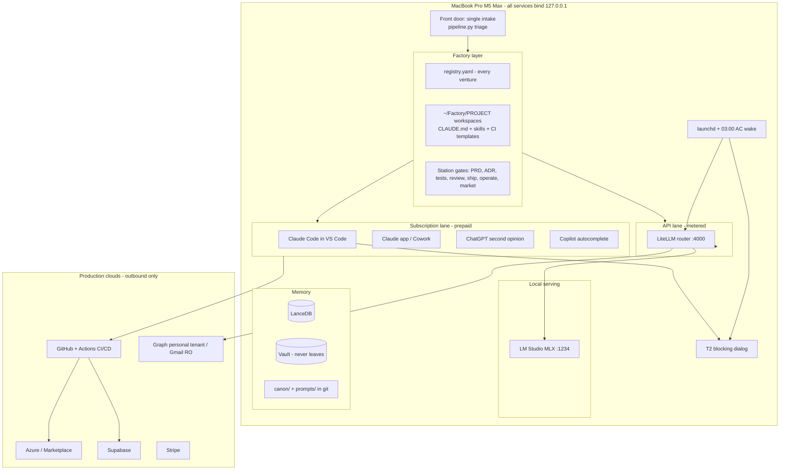

# Personal AI Hub — Target-State Architecture
**Owner:** Kaustubh (Kos) Bajpai · **Version:** 4.0 · **Date:** 15 July 2026
**Frame:** this MacBook is the **front door of a hybrid AI-native software factory** — the single intake and factory floor for Agenticality products, NXI Labs work, client engagements, and personal operations. Production lives in the clouds; **the Mac pushes, it never serves.**
**Primary goal (every decision traces to this):** *maximum shipped value per Kos-hour across Agenticality, NXI, and personal life, on this hardware, at world-class robustness — solo-founder leverage.*

---

## 1. Hardware & platform ground truth (confirmed)

| Item | Value |
|---|---|
| Machine | MacBook Pro 14" (2026), Mac17,7 / MGDU4LL/A — **M5 Max**, 18C CPU (6 super + 12 perf), **32C GPU**, 36GB · 2TB · macOS 26.5.2, SIP on |
| Bandwidth | **460GB/s** (32-core-GPU variant; the 614 figure is the 40-core config — [Apple](https://support.apple.com/en-us/126318)) |
| Envelopes | Inference **~24–27GB** with daily apps open · model disk cap **200GB** |
| Prepaid capacity | **Claude Pro** (confirmed 24 Jul) · ChatGPT Plus/Pro · GitHub Copilot |
| Editor / canonical PIM | **VS Code** · **Outlook (M365 personal tenant)**; employer tenant permanently excluded |

Physics: decode is bandwidth-bound; prefill is compute-bound and M5-accelerated **under MLX only** today ([Apple ML Research](https://machinelearning.apple.com/research/exploring-llms-mlx-m5), [LLMCheck](https://llmcheck.net/blog/apple-silicon-m5-max-local-ai-guide/)). All t/s figures are provisional until **`bench.sh` measures this machine** — a hard gate, not a note. High Power Mode on for long AC sessions if offered. Shortcuts can call Apple Intelligence today; the `fm` CLI + Python SDK arrive with macOS 27 ([WWDC26](https://developer.apple.com/wwdc26/guides/apple-intelligence/)) as an upgrade path.

---

## 2. Shape of the system

**One machine · zero inbound · two cloud lanes · one router for everything metered · one factory discipline over it all.**

**Lane doctrine:** subscription lane = everything interactive (~$0 marginal); local = everything private/high-volume/S3; API lane = programmatic/scheduled only, metered with $100/$250 alerts; Max-limit hits handled consciously, never silently. **No agent-gateway framework on this machine** (2026's public [security record](https://www.betterclaw.io/blog/openclaw-security-2026) of that category settles it generically) — orchestration is Claude Code + MCP interactively, an owned `pipeline.py` + launchd in the background. **Future GPU-box seam:** `LOCAL_LLM_BASE_URL` — one line to point at owned LAN hardware later; zero-inbound posture untouched.

---

## 3. The software-factory layer (v4.0)

### 3.1 Front door
Everything enters through one intake — a thought typed at the terminal, a starred email, a file dropped in `~/AgentHub/inbox`. Triage (local 4B, guided JSON) classifies it: **personal task · client engagement · product workstream · noise** — and stamps entity, sensitivity, lane. Nothing bypasses the front door; that single habit is what makes the rest a factory instead of a pile.

### 3.2 Project registry — one source of truth
`~/AgentHub/factory/registry.yaml`: every venture with `name, entity (agenticality|nxi|personal|client), stage (intake→spec→build→ship→operate→parked), status, repo, deploy_target, sensitivity`. The digest reads it; the monthly review grooms it. **WIP limit: 2 products `active` at once** — a solo founder with a full-time role ships more by building less at a time; everything else is honestly `parked`, not secretly stalled.

### 3.3 Workspaces
Each product = `~/Factory/<name>/`, its own git repo, scaffolded by `factory new <name>`: a `CLAUDE.md` (project context contract for every Claude Code session), `docs/` (PRD, ADRs), `.github/workflows/ci.yml` from template, shared skills linked from `~/AgentHub/factory/skills/`. Per-project secrets namespace in Keychain: `agenthub.<project>.<KEY>` — no shared blast radius. Client work lives under `~/Factory/clients/<client>/` with **hard isolation: no cross-client context, ever** (sub-class S1c below).

### 3.4 Stations & gates (the assembly line)

| Station | Lane | Definition-of-done gate |
|---|---|---|
| Intake → opportunity brief | Local 4B/35B | Brief written, entity + sensitivity stamped, registry entry |
| Spec (PRD) | Claude app/Code (sub) | Acceptance criteria written and testable |
| Architecture (ADR) | Claude app Opus (sub) | ADR committed: decision, alternatives, consequences |
| Build | **Claude Code agentic** (sub), TDD | Tests green locally; CLAUDE.md kept current |
| Review | **Second model**: ChatGPT (sub) by default; local 27B for sensitive code | Review notes addressed or consciously waived |
| Ship | `git push` → **GitHub Actions CI/CD** | CI green, tagged release; deploy creds live in Actions secrets, **not on the Mac** |
| Operate | API lane, scheduled | Health/metrics pull (aggregates only) into the digest; runbook entry exists |
| Market | Local draft → Claude polish (sub) | GTM artifact passes the brand check |

Direct production mutation from the Mac (an `az`/`supabase`/`stripe` CLI write against prod) is **T2** — wrapped by `guard`, which pops the approval dialog first. The sanctioned ship path is always CI.

### 3.5 Toolchain & data classes

| Tool | Role | Data class |
|---|---|---|
| GitHub (+Actions) | Source of truth + CI/CD; fine-grained per-repo tokens | S1p |
| Azure / Marketplace | Production + distribution for D365-adjacent products | S1p |
| Supabase | Product backends; **product telemetry never bulk-copied to the Mac — aggregate queries only** | S1p (+ end-user data stays in production) |
| Stripe | Revenue; read via scheduled aggregates | S1p |
| Lovable / design SaaS | Frontend generation | S1p, no secrets pasted |
| Graph (personal tenant) / Gmail RO / iCloud RO | Chief-of-staff integrations | S0–S2 |

### 3.6 Sensitivity classes (v4.0 refinement)
**S0** public · **S1p** products (Agenticality/NXI — cloud permitted, both lanes) · **S1c** client engagements (cloud permitted; **per-client folders; no cross-client context; client named in every artifact header**) · **S2** Envelope Collective (Neelam's recorded approval for writes) · **S3** finance/tax (**local-only, router-enforced**; anonymisation recipe + per-task approval for rare escalation). Entity separation (Agenticality vs NXI) is carried in the registry and repo ownership — IP hygiene by structure.

---

## 4. Local model portfolio (unchanged; bench-gated)

| Role | Model | Size | Est. t/s @460 (verify) |
|---|---|---|---|
| Quality brain | **Qwen3.6-35B-A3B** MLX 4-bit | ~18–19GB | ~55–85 ([InsiderLLM](https://insiderllm.com/guides/best-local-llms-mac-2026/)) |
| Tools / light brain | **GPT-OSS-20B** MXFP4 | ~12–13GB | ~70–100 |
| Offline/sensitive coding | **Qwen3.6-27B** 4-bit | ~16.8GB | ~18–28 |
| Triage | **Qwen3.5-4B** 4-bit | ~2.5GB | ~100–150+ |
| Embeddings | Qwen3-Embedding-0.6B | ~0.7GB | — |

Resident sets: *standard* ≈24–26GB · *light* ≈16GB · *coding* swaps 27B in. Repos+revisions **and MLX runtime version** pinned in `models.lock.yaml` (a security control); prompt-cache on; promotion only on eval wins; 200GB cap enforced.

---

## 5. Routing (table + tree unchanged in structure; factory rows added)

Core rows as v3.0 (triage/summaries/drafts local · research and deep reasoning subscription-lane · programmatic escalations API · **S3 local-only** · Batch API for async bulk). Factory additions:

| Task class | Default route | Escalation | Ceiling |
|---|---|---|---|
| PRD / ADR drafting | Claude app/Code (sub) | — | S1p/S1c |
| Agentic build | Claude Code (sub) | frontier-hard → Fable 5, conscious | S1p/S1c |
| Code review 2nd opinion | ChatGPT (sub) | sensitive code → local 27B | S1p/S1c/S3 |
| Operate: metrics pulls | API lane (Haiku/Sonnet) or plain scripts | — | S1p aggregates |

API prices (Jul 2026, per MTok in/out): Haiku 4.5 $1/$5 · Sonnet 4.6 $3/$15 · Opus 4.8 $5/$25 · Fable 5 $10/$50; cache ≈10%, batch 50% ([Anthropic](https://platform.claude.com/docs/en/about-claude/pricing)).

## 6. Memory
As v3.0: LanceDB KB (+ stdio **kb-mcp**, no listener, vault excluded) · SQLite state/audit (12-month retention) · `canon/` + `prompts/` as reviewed code · vault never leaves. Factory adds: registry.yaml (tracked), per-project `CLAUDE.md` as the project-memory contract, and `~/Factory` **included in nightly restic** (build artifacts excluded).

## 7. Autonomy & approvals
T0 read · T1 draft/create (files, mail drafts, calendar events, To Do, **scaffolds**) · T2 send/delete/spend/**prod-mutate** — blocking dialog, default Deny, timeout-to-deny, source quoted, logged. External content (mail, web, docs, **calendar invites**) is data, processed with read-only tools. Digest = wake notification + `digests/<date>.md`, now including **factory status** (active projects, stage moves, CI reds, Max-limit hits).

## 8. Overnight window
03:00 `pmset` wake on AC → serialised `nightly.sh`: ingest → KB maintenance → Batch pickups → **operate-station pulls** → digest prep → restic (`~/AgentHub` + `~/Factory`) → `doctor.sh`. Missed nights run at next wake.

## 9. Security posture
Loopback-only · block-all-incoming + stealth · Sharing off · no SSH · fresh keys minted for this machine · Keychain/`op` only · no Full Disk Access · notarized apps + trusted taps · Graph **tenant-pinned and asserted** · employer boundary three-layer (no work accounts on agent surfaces, router denylist, tenant pin) · supply chains (brew/PyPI/npm/HF/extensions/**Actions workflows**) pinned and reviewed monthly. Production credentials: CI-resident by default; local per-project tokens least-privileged; prod writes T2-guarded.

## 10. Evaluation
15-task set + 2 lane-comparisons + golden-drift, monthly from week 1; escalation band 20–40%; missed-escalation diffs; <90% local → cloud default. **Factory metrics (lightweight, registry-derived):** cycle time intake→ship per product, CI green rate, WIP adherence — in the digest, not a BI system.

## 11. Degraded modes
As v3.0 (offline queue · provider fallback chains, S3 never falls back · Max-limit = conscious choice · KeepAlive restarts · missed window = next wake · restore <4h) **plus:** GitHub/Azure/Supabase outage → ship gates block, build continues locally, digest flags it — production platform availability is their SLA, not this machine's.
