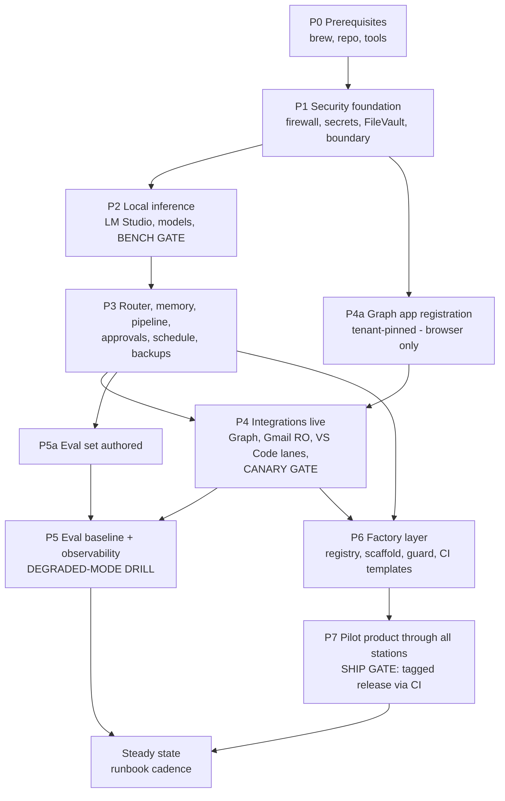

# Execution Map — Hybrid AI-Native Software Factory
**Version 1.0 (for system v4.0) · 15 July 2026.**
**What this is:** the dependency-explicit build order — what blocks what, what runs in parallel, what gate ends each phase, and the critical path to a working factory. **Commands live in `03-implementation-plan.md`**; this map is the sequencing authority. Rule one: **no phase starts before its dependencies' exit gates are green.**

---

## 1. The dependency DAG

**Parallel tracks worth exploiting:** model downloads (P2) run in the background/overnight while nothing else blocks · **P4a (Graph app registration) needs only a browser** — do it any time after P1 · the eval set (P5a) is authoring work, doable while downloads run · Time Machine's first full backup runs alongside anything.

**Critical path:** P0 → P1 → P2(bench) → P3 → P4(canaries) → P6 → P7(ship). Everything else hangs off it.

---

## 2. Phase table — dependencies, gates, effort

| Phase | Depends on | Effort | Exit gate (must be green) |
|---|---|---|---|
| **P0** Prerequisites | — | 45 min | Tooling installed; `~/AgentHub` repo pushed with `.gitignore` proven (no data/secrets trackable) |
| **P1** Security foundation | P0 | ½ day | Loopback-only listen check passes; stealth confirmed from second device; fresh keys in Keychain; FileVault on; canon seeded & committed |
| **P2** Local inference | P1 (posture before services) | ½ day + downloads | **BENCH GATE:** `bench.sh` log saved; `models.lock.yaml` records repos+revisions+runtime; standard-mode peak ≤ ~26GB or fallback decision taken; port 1234 loopback-only |
| **P3** Router · memory · pipeline · schedule · backups | P2 | 1 day | Router serves local+cloud with spend logged; **S3 virtual key rejects cloud**; schema-invalid task refused; kb-mcp answers in Claude Code; vault unreadable from a session; reboot-survival proven; 03:00 wake scheduled; first restic snapshot exists |
| **P4a** Graph registration | P1 | 30 min | App registered in **personal tenant**, tenant ID recorded, device-code flow enabled |
| **P4** Integrations | P3 + P4a | 1 day | Graph calendar/To Do live with tenant assertion proven (a `common`-authority token hard-fails); Gmail/iCloud read-only; **CANARY GATE:** email *and* calendar-invite injection both produce dialogs, not actions; three VS Code lanes verified |
| **P5a** Eval authoring | P3 | 2–3 h (parallel) | 15 tasks + 2 lane-comparisons + drift task written with acceptance checklists |
| **P5** Eval baseline + observability | P4 + P5a | ½ day | Baseline scored & saved; digest arrives at wake; **DEGRADED DRILL:** offline queue, LM Studio kill/restart, budget-alert test all exercised |
| **P6** Factory layer | P3 + P4 | 1 day | `factory new` scaffolds a workspace with CLAUDE.md + CI + branch protection; registry lists seeds; WIP warning fires at 3rd activation; `guard` pops the dialog; restic scope includes `~/Factory` |
| **P7** Pilot product | P6 | 3–5 days elapsed | **SHIP GATE:** one product through *every* station — PRD ✓ ADR ✓ tests green ✓ second-model review ✓ **CI-tagged release** ✓ operate entry ✓ one GTM artifact ✓ — registry stage updated, retro logged |

**Timeline:** Week 1 → P0–P5 (baseline eval Friday). Week 2 → P6 Monday, P7 pilot Tue–Fri. **A working, measured, world-class factory in ~10 working days**, with every gate evidenced rather than assumed.

---

## 3. Task-level notes on the two new phases

**P6 — Factory layer (commands in plan, Phase 6).** Order inside the phase: `yq` + directories → `registry.yaml` seeded (known products parked; `park_when:` criteria per entry) → `factory` CLI (list/new/status, WIP warning) → templates (`CLAUDE.md`, `ci.yml` with lint+test) → `guard` wrapper → branch-protection defaults via `gh` → restic scope extension → commit. Nothing here touches production; it is pure scaffolding, which is why it needs only P3/P4 (approvals + Claude Code wiring) beneath it.

**P7 — Pilot (commands in plan, Phase 7).** Choose **one** pilot — the product closest to revenue, not the most interesting one; the map is agnostic (`<PILOT>`), the registry decision is yours and takes thirty seconds, not a planning cycle. The pilot's purpose is to *prove every gate under real load* and surface friction while the factory is one product deep. Its retro (`hub log`) is the first input to the monthly review. Batch-onboarding the remaining parked products happens only after the pilot ships — one at a time, WIP ≤ 2, forever.

---

## 4. Robustness rules (how "100%" is actually enforced)

1. **Gates, not vibes:** a phase is done when its exit-gate checklist in the plan passes — each gate is observable (a log, a rejection, a dialog, a tag), never "seems fine".
2. **The two standing gates never retire:** `bench.sh` re-runs after every MLX runtime change; both injection canaries re-run quarterly.
3. **Dependency honesty:** if a gate fails, downstream phases *wait* — the map's edges are the schedule, not the calendar.
4. **Rollback is pre-decided:** every updateable component (models, runtime, LiteLLM, extensions, workflows) is version-pinned with its previous version retained for the monthly window; `models.lock.yaml` and the repo are the rollback substrate.
5. **Single-machine redundancy = backups actually restored:** the quarterly drill (one vault file + one product repo) is on the calendar before P7 completes, or P7 is not complete.
6. **Everything is re-runnable:** every phase's commands are idempotent or safely re-executable — a half-completed phase is resumed, not untangled.

## 5. Steady-state rhythm (post-P7)
**Daily:** digest at first wake (tasks, routing split, spend, Max-hits, CI status, factory stage moves). **Nightly (03:00, AC):** ingest → maintenance → operate pulls → digest prep → restic → doctor. **Monthly (first Saturday):** runbook checklist — security → cost/lanes → evals → update window → hygiene → **factory registry groom** (stages honest, WIP ≤ 2, park/kill criteria applied). **Quarterly:** restore drill, canaries, ambient-function question, machinery-bias review (Decision log, round-4 counter-note).
